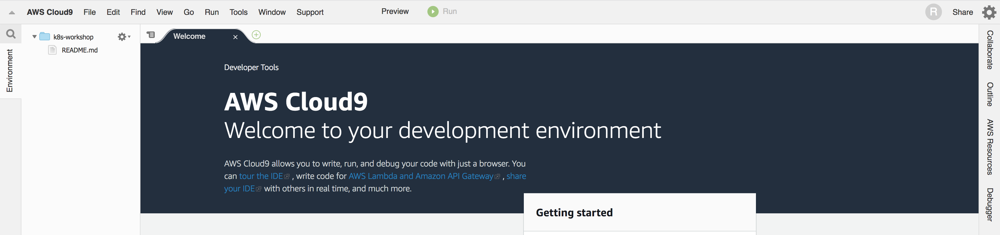
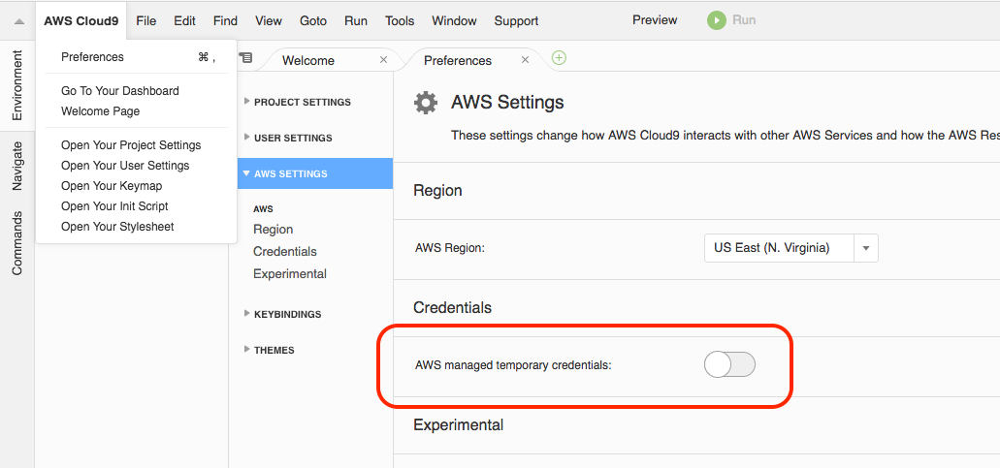

# Getting Started with AWS

## Module Objectives

Before getting started, you first have to prepare the environment for the workshop.

1. Get an AWS account from the instructor
1. Connect to the AWS Cloud9 IDE using the AWS account
1. Download the lab source code from GitHub

---

## Amazon Web Services Overview

- Managed by Amazon
- Provides basic resources like compute, storage and network
- Also provides services like Relational Database Service and Managed Kubernetes Service
- All operations can be done through the API
- SLAs define reliability guarantees for the APIs
- Three ways of access
- API calls
- SDK commands
- Amazon Web Console

Amazon Web Services product groups:

- Compute
- Storage
- Database
- Migration & Transfer
- Networking & Content Delivery
- Developer Tools
- Robotics
- Blockchain
- Satellite
- Management & Governance
- Media Services
- Machine Learning
- Analytics
- Security, Identity & Compliance
- Mobile Services
- AR & VR
- Application Integration
- Internet of Things
- Game Development

You will use these services while doing the lab:

- Amazon Elastic Container Service for Kubernetes: Create Kubernetes cluster
- Identity and Access Management: Manage users and permissions
- Elastic Compute Cloud: Run virtual machines for worker nodes
- Virtual Private Cloud: Connectivity between the nodes
- Elastic Load Balancing: Create Ingress of LoadBalancer type
- Elastic Block Store: Persistent volume for Jenkins
- CodeCommit: Hosting source code for an app
- CodeBuild: Build Docker containers
- Elastic Container Registry: Storing versioned Docker images of an app

Amazon Web Console is the admin user interface for Amazon Web Services. With Amazon Web Console you can find and manage your resources through a secure administrative interface.

Cloud Console features:

- Resource Management
- Billing
- SSH in Browser
- Activity Stream
- Cloud9 Console

Cloud SDK provides essential tools for cloud platform.

- Manage Virtual Machine instances, networks, firewalls, and disk storage
- Spin up a Kubernetes Cluster with a single command

---

## Amazon Web Services (AWS) Account

In this workshop you will run Kubernetes in AWS. We have created a separate account for each student. You should receive an email with the credentials to log in.

We recommend using Google's Chrome browser during the workshop.

1. Go to <https://console.aws.amazon.com/>
1. Enter the username
1. Enter the user password

    > Note: Sometimes AWS asks for a verification code when it detects logins from unusual locations. It is a security measure to keep the account protected. If this happens, please ask the instructor for the verification code.

1. In the top right corner select the US East (N. Virginia) region.

## AWS Cloud9 Console

AWS Cloud9 is a cloud-based integrated development environment (IDE) for managing cloud resources. Most of the exercises in this course are done from the command line, so you will need a terminal and an editor.

1. Visit https://us-east-1.console.aws.amazon.com/cloud9/home/product?region=us-east-1
1. Click "Create Environment"
1. Name your environment "eks-workshop"
1. Click Next
1. Accept the defaults by clicking Next
1. Click "Create Environment"

You should eventually see something like this:



### Cloud9 Instance Role

The Cloud9 IDE needs to use the assigned IAM Instance profile. Open the "AWS Cloud9" menu, go to "Preferences", go to "AWS Settings", and disable "AWS managed temporary credentials" as depicted in the diagram here:



## Create an admin service account
1. Login to the IAM console here: https://console.aws.amazon.com/iam/
1. Ensure billing is enabled
  1. Click the login name in the top right
  1. Click "My Account"
  1. Scroll down to "IAM User and Role Access to Billing Information"
  1. Edit
  1. Check "Activate IAM Access"
  1. Click "Update"
1. Go back to https://console.aws.amazon.com/iam/
1. Click "Users" in the left pane
1. Click "Add User"
1. Give the user a name
1. Check "Programmatic access" and "AWS Management Console access"
1. Supply a custom password
1. Uncheck "Require password reset"
1. Click "Next: Permissions"
1. Create a Group
1. Name the group "Administrators"
1. Filter permissions to find the "AdministratorAccess" Policy
1. Check the "AdministratorAccess" Policy
1. Create Group
1. Click "Next: Tags"
1. Click "Next: Review"
1. Click "Create User"
1. **Please record the Access Key ID and Secret Access Key**


## Configure the AWS CLI for our new user
1. In the Cloud9 IDE Terminal window, run `aws configure`
1. Supply the Access Key ID and Secret Access Key from above
1. Use Region `us-east-1`
1. Leave output format blank


## Download the Lab Source Code from GitHub

Clone the lab repository into your cloud shell, then `cd` into that directory:

```shell
git clone https://github.com/SergeyHudinskiy/k8s-training-labs-fundamentals-r3.git kubernetes-training
```
```shell
cd kubernetes-training
```
