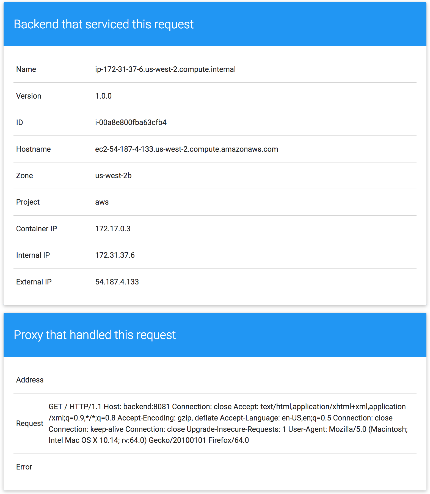

# Containers

## Module Objectives

1. Build an application Docker image
1. Run an application locally

---

## The Sample App

You'll use a very simple sample application `awsme` as the basis for your Continuous Delivery (CD) pipeline. `awsme ` is written in Go and is located in the `sample-app/aws.sample-app` directory in this repo. When you run the `awsme ` binary on a AWS instance, it displays the instance's metadata on a card.



The binary supports two modes of operation, designed to mimic a microservice.

In backend mode, `awsme ` will listen on a port (8080 by default) and return AWS instance metadata as JSON, with the HTTP header `content-type=application/json`.

In frontend mode, `awsme` will query a backend `awsme ` service and render that JSON in the UI you saw above. The architecture looks roughly like this:

```
-----------      ------------      ~~~~~~~~~~~~        -----------
|         |      |          |      |          |        |         |
|  user   | ---> |  awsme   | ---> | lb/proxy | -----> |  awsme  | ----+
|(browser)|      |(frontend)|      |(optional)|   |    |(backend)|     |    +------+
|         |      |          |      |          |   |    |         |     |    |      |
-----------      ------------      ~~~~~~~~~~~~   |    -----------     +--->|  DB  |
                                                  |    -----------     |    |      |
                                                  |    |         |     |    +------+
                                                  |--> |  awsme  |-----+
                                                       |(backend)|
                                                       |         |
                                                       -----------
```

Both the frontend and backend modes of the application support two additional URLs:

1. `/version` prints the version of the binary (declared as a const in `main.go`).
1. `/healthz` reports the health of the application. In frontend mode, health will be OK if the backend is reachable.

A deployment is a supervisor for pods and replica sets, giving you fine-grained control over how and when a new pod version is rolled out as well as rolled back to a previous state.

> Note: Alough this application mimics a microservice, it is still a single application inside a single image. It is best and common practice to create separate Docker images for each individual component in your microservice. We use a single image for simplicity in the workshop.

## Build the Application Docker Image

1. Open the [AWS Console](https://console.aws.amazon.com/) from your browser and then open the AWS Cloud9 IDE.
1. Navigate to the `kubernetes-training/sample-app/aws.sample-app` folder.

    ```shell
    cd ~/environment/kubernetes-training/sample-app/aws.sample-app
    ```

    > Note: `kubernetes-training` repository should be cloned in the previous exercise.


1. Create an Amazon ECR repository to store your sample-app image. Note the repositoryUri in the output.

    ```sh
    aws ecr create-repository --repository-name sample-app
    ```

    Output:

   ```json
    {
        "repository": {
            "registryId": "aws_account_id",
            "repositoryName": "sample-app",
            "repositoryArn": "arn:aws:ecr:us-east-1:aws_account_id:repository/sample-app",
            "createdAt": 1548684141.0,
            "repositoryUri": "aws_account_id.dkr.ecr.us-east-1.amazonaws.com/sample-app"
        }
    }
   ```
1. Run this  command  to retrieve a token that is valid for a specified registry for 12 hours and then execute the printed command to log in to your registry with Docker.

	```sh
	aws ecr get-login --no-include-email
	```
1. Set the `IMAGE` environment variable to the repositoryUri value from step 3 and build the Docker image.

    ```shell
    export AWS_ACCOUNT_ID="1234567890"
    export IMAGE=$AWS_ACCOUNT_ID.dkr.ecr.us-east-1.amazonaws.com/sample-app:1.0.0
    docker build . -t $IMAGE
    ```

    * `dkr.ecr.us-east-1.amazonaws.com` is the repository hostname.

    * `$AWS_ACCOUNT_ID` is the id of your AWS account. Could be found [here](https://console.aws.amazon.com/billing/home?#/account)

    * `sample-app` is the name of the application image.

    * `1.0.0` is the image tag.

    * `docker build` command packages the application into a docker container. It does the following steps:

      * Reads the Dockerfile
      * Creates a new container from the base image specified in the Dockerfile
      * Runs all commands from the Dockerfile
      * Saves the container filesystem as a new Docker image

1. Push the image to the Amazon Elastic Container Registry.

    ```sh
    docker push $IMAGE
    ```

1. Go to the [Amazon Elastic Container Registry (ECR)](https://console.aws.amazon.com/ecr/repositories?#) to make sure that `sample-app` image is present.

## Run the Application in the AWS Cloud9

1. Run the database container.

    ```shell
    docker run --rm \
      --name db \
      -e MYSQL_ROOT_PASSWORD=root \
      -d mysql
    ```

    * `mysql` tells Docker to use the `library/mysql:latest` image for the database from the `hub.docker.io` repository.

    * `-d` tells Docker to run the container in the background. If you need you can still use the `docker logs` command to examine the container output.

    * `-e MYSQL_ROOT_PASSWORD=root` sets the database administrator password to `root`.

    * `--name db` sets the name of the container which you can refer to from other commands.

    * `--rm` tells Docker to delete the container as soon as it is stopped or the root process inside the container finishes execution.

1. Run the backend container.

    ```shell
    docker run --rm \
      --name backend \
      --link db \
      -p 8081:8081 \
      -d $IMAGE \
      app -mode=backend -run-migrations -port=8081 -db-host=db -db-password=root
    ```

    * `--link db` [links](https://docs.docker.com/network/links/) the backend container to the database container.

    * `-p 8081:8081` expose port 8081 from the container as port `8081` on the host.

    * `$IMAGE` tells Docker to use image we built earlier for the sample app.

    * `app -mode=backend -run-migrations -port=8081 -db-host=db -db-password=root` is the application start command. `app` is the executable file that we built and packaged inside the container previously. In these parameters, we specify that the app should listen at port `8081` and how it can connect to the database.

1. Run the frontend container.

    ```shell
    docker run --rm \
      --name frontend \
      --link backend \
      -p 8080:8080 \
      -d $IMAGE \
      app -mode=frontend -backend-service=http://backend:8081
    ```

    Here we run the same executable but now we provide the parameter `-mode=frontend` which instructs the app to run in frontend mode. We also provide the connection string to the backend.

1. Verify that all containers are running.

  ```shell
    docker ps
   ```

    Output:

  ```shell
    CONTAINER ID        IMAGE                                                     COMMAND                  CREATED              STATUS              PORTS                    NAMES
    7f694b1b5b56        947669649772.dkr.ecr.us-east-1.amazonaws.com/sample-app   "app -mode=backend -…"   45 seconds ago       Up 44 seconds       0.0.0.0:8081->8081/tcp   backend
    32402d90f709        mysql                                                     "docker-entrypoint.s…"   About a minute ago   Up About a minute   3306/tcp, 33060/tcp      db
    2ac6a9290a18        947669649772.dkr.ecr.us-east-1.amazonaws.com/sample-app   "app -mode=frontend …"   2 minutes ago        Up 2 minutes        0.0.0.0:8080->8080/tcp   frontend
   ```

1. Click on the `Preview` button in Amazon Cloud9 and then select `Preview running application`. This opens an application preview tab within the environment, and then displays the application's output on the tab. See this [link](https://docs.aws.amazon.com/cloud9/latest/user-guide/app-preview.html#app-preview-preview-app) for more details about web preview.

1. Check that the app is working.

    The application will show some information about the VM that hosts the app. We take this information from [AWS instance metadata](https://docs.aws.amazon.com/AWSEC2/latest/UserGuide/ec2-instance-metadata.html).

    You should be able to add notes in the bottom box. Notes were added to demonstrate how the app can handle persistent data. In our case we stored them in the mysql database.

## Mount a persistent volume

By default Docker stores a container filesystem in a certain folder on the host machine. This means that if a container is deleted its data will be lost. Let's verify this.

1. Open the application UI, scroll to the bottom and add a few notes.

1. Stop the `db` container.

    ```sh
    docker stop db
    ```

    > Note: Because of the fact that we run `db` container with the `--rm` option, the container is automatically deleted after we stop it.

1. Recreate the `db` container with a persistent volume.

    ```sh
    docker run --rm \
      --name db \
      -v $HOME/mysql_data:/var/lib/mysql \
      -e MYSQL_ROOT_PASSWORD=root \
      -d mysql
    ```

    > Note: this will create the `mysql_data` directory in your home directory. This will be mounted inside the folder as `/var/lib/mysql`

1. Restart the `backend` app.

    ```sh
    docker stop backend
    docker run --rm \
      --name backend \
      --link db \
      -p 8081:8081 \
      -d $IMAGE \
      app -mode=backend -run-migrations -port=8081 -db-host=db -db-password=root
    ```

    > Note: the backend app will fail to start if it cannot reach `db`. Please wait a few seconds for the `db` to be ready before starting the `backend` app. Use `docker ps` to ensure the `backend` is up. If the `backend` does not come up, please retry starting the `backend` with the command above.

    > Important: This step is required because the backend app creates a new database on startup if it doesn't exist.

1. Make sure that the data survives between `db` container restarts.

## Optional Exercises

### Explore How Docker Networking Works
1. Adapt the application to use docker host networking. Use [this](https://docs.docker.com/network/network-tutorial-host/) doc as an example on how to use host networking. Make sure you delete the `--link` and `-p` parameters and update the startup commands to use `localhost` instead of individual containers DNS names.

1. Use commands such as `ip addr show`, `ip route show` inside a container and on the Cloud Shell VM. Do this for containers running in both `bridge` and `host` modes. Make sure you understand how networking works in both cases. (You can use `iproute2` package to install ip utility on Ubuntu)

    <details><summary>SOLUTION - CLICK ME</summary>
    <p>

    ```shell
    docker run --rm \
      --name db \
      --network host \
      -v $HOME/mysql_data:/var/lib/mysql \
      -e MYSQL_ROOT_PASSWORD=root \
      -d mysql

    docker run --rm \
      --name backend \
      --network host \
      -d $IMAGE \
      app -mode=backend -run-migrations -port=8081 -db-host=localhost -db-password=root

    docker run --rm \
      --name frontend \
      --network host \
      -d $IMAGE \
      app -mode=frontend -backend-service=http://localhost:8081
    ```

    ```shell
    sudo netstat -tulpn
    ```

    </p>
    </details>

### Examine Docker filesystem

1. Use the `GraphDriver -> Data` property of the  `docker inspect` command output to figure out the location of a container filesystem.

1. Refer to the [docker documentation](https://docs.docker.com/storage/storagedriver/overlayfs-driver/#how-the-overlay2-driver-works) to understand the structure of the `/var/lib/docker/overlay2` folder and how image layers are represented on the host.

1. Read ["How container reads and writes work with overlay or overlay2"](https://docs.docker.com/storage/storagedriver/overlayfs-driver/#how-container-reads-and-writes-work-with-overlay-or-overlay2) from the docker documentation, then try to edit a file inside a container. Make sure that the file was copied from the image lower directory to the container upper directory.

    <details><summary>SOLUTION - CLICK ME</summary>
    <p>

    ```shell
    docker inspect --format='{{.GraphDriver.Data}}' CONTAINER_ID
    ```

    > Note: You must be sudo to access the directories.

    </p>
    </details>

### Examine how docker uses cgroups to enforce container limits and isolation

1. Run a container with a memory limit.

    ```shell
    docker run --rm -d -m 128MB --name mem_limit nginx
    ```

1. Use `docker ps` to get the container ID.

1. List all container cgroups.

    ```shell
    find  /cgroup/memory/docker/ -name "<container-id>*"
    ```

    in case of Ubuntu

    ```
    find /sys/fs/cgroup/memory/docker -name "<container-id>*"
    ```

1. Open the `memory.limit_in_bytes` file inside folder from previous output and compare it with the same file for a different container.

## Clean Up

```shell
docker stop $(docker ps -aq)
```
